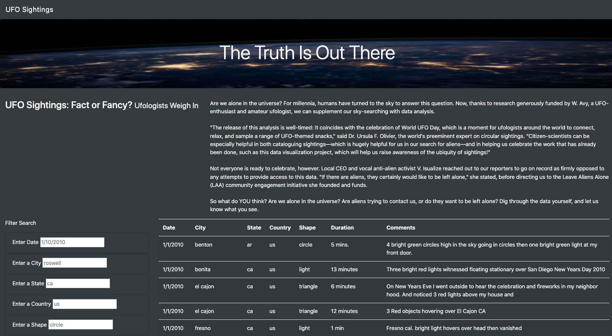
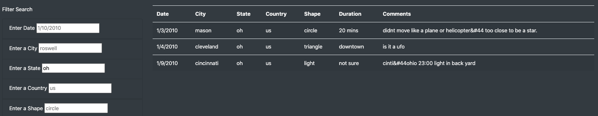
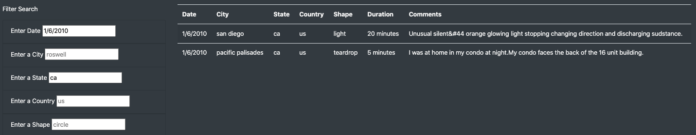
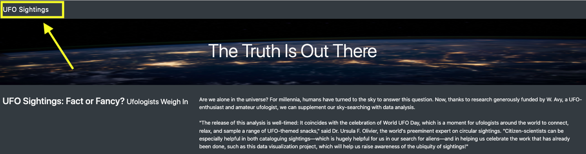

# UFOs

[HTML file for UFO Webpage](https://github.com/c-geisel/UFOs/blob/main/index.html)

[JavaScript file to Create Data Table](https://github.com/c-geisel/UFOs/blob/main/static/js/app.js)

## Overview of Project
In a previous analysis we were presented with a set of data about UFO sightings in a small town in Oregon. This town is famous for these sightings and they were looked into more throughout the analysis. Using the data file, JavaScript was used to display the information as a table with data so that filters could be applied. All of this information was then displayed in an HTML page. This current analysis is applying changes to this webpage by adding more filter options to the HTML page. This is done by modifying functions in the JavaScript file.

## Results
Upon reafactoring the scripts a website is obtained with 5 filters as seen below.

This webpage has an article about the existence of UFOs that can be read, then below is the data table with filters. To use this data to your advantage, choose a filter you want to add. Let's say you want to see all of the UFO sightings in Ohio, type "oh" into the filter and once the typing is complete the data is filtered to all sightings in this state.

Multiple filters can be applied at once as well. For example, you can find all sightings in California on January 6, 2010 by entering in "ca" and "1/6/2010" into their respective filters. 

To return to the original unfiltered data table, click the "UFO Sightings" link on the top left-hand corner of the screen to return to the initial data table. 

## Summary
### A Drawback of the Design
One drawback to this design is that it is very selective in what is typed into the filter section. For example, typing in "Ohio" as the state would not lead to any results being shown as "oh" must be typed in. Captial letters will lead to errors and a lowercase letters must be used. Also simple mistakes may result in now data being shown as in typing "sandiego" instead of "san diego". If a user did not know of these requirements, they may think no sightings occured which could effect their analyses. 

### Reccomendations for Future Designs
1. Because of this drawback mentioned above, a reccomendation would be to adjust the filtering script to allow for uppper case letters and the absence or addition of spaces. Another beneficial addition would be to allow for the full name of states as opposed to the abbreviations. This would account for minor errors that may occur when users mistype their filtering statements. It may also be beneficial to add a message to the table for when no results are shown that says "No results shown with this filter, be sure that searches are in the same format as listed in the table." 

2. Another feature that would be beneficial to this table could be to organize the data based on column. Currently, the table is ordered by ascending dates, but some users may find it beneficial to organize the state or shape columns alphabetically so that you could more easily see what options are avalable to view by based on desired data. 
